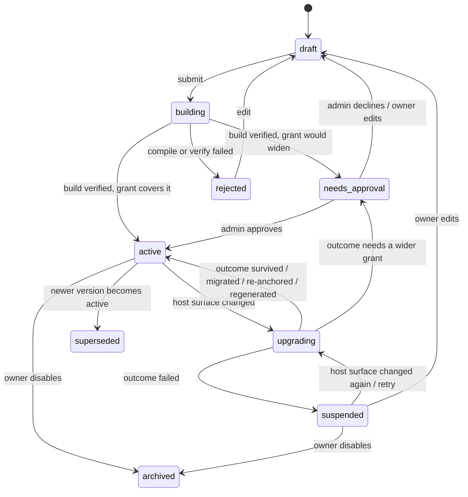
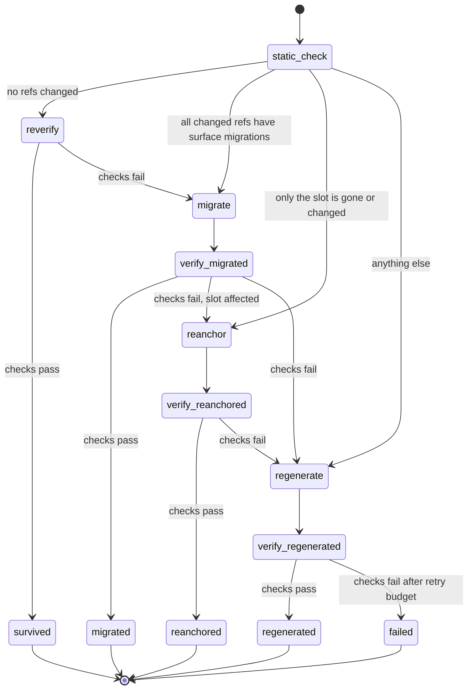

# ADR 0001: Architecture, spec format and lifecycle

- Status: Accepted
- Date: 2026-09-28

## Context

AI lets non-developers customize software, but what they get today is
generated *code*: a plugin, a script, a patch. It works on the day it is
generated and then rots. When the host app updates, nobody is around who can
read, fix or even judge that code.

Graft inverts this. A customization's source of truth is a short, human
readable spec: what it should do and how we know it does it. Code, or in our
case a declarative UI tree, is a disposable build of that spec against one
specific version of the host. When the host changes, we rebuild and re-check
against the same acceptance criteria. The spec is the contract, the criteria
are the guarantee, and the platform can change underneath as much as it likes.

Two properties separate this from "specs in a repo":

1. **Multi-tenant.** Specs are records owned by a user, team or
   organization inside a running app, not files in a developer's checkout.
   A thousand tenants may each have their own variant of the same idea.
2. **Unattended maintenance.** Nobody reviews diffs. The system itself has
   to decide whether a customization still holds after a host upgrade, and
   say so in terms the owner understands.

Related work this builds on:

- [Shipping a prompt](https://aifoc.us/shipping-a-prompt/) and
  [prompt-in-a-box](https://github.com/PaulKinlan/prompt-in-a-box): the
  prompt is the program, and a manifest declares permissions up front that
  cannot be escalated at runtime (tools without a grant are simply not
  offered). It even has a declarative JSON UI renderer and an `update`
  trigger that re-runs the prompt after an upgrade. Graft keeps "intent is
  the artifact" and "permissions in the manifest", but pins and verifies the
  generated output instead of regenerating it on every run, so behavior is
  stable and inspectable between host changes.
- [Whither CMS?](https://aifoc.us/whither-cms/): when generating UI is cheap,
  the durable value of a platform is its data, permissions and extension
  surface. That is exactly what a Graft host adapter describes.
- The plugin builder in
  [wp-ai-experiments](https://github.com/westonruter/wp-ai-experiments):
  an agent loop (discover abilities, execute abilities, write files) that
  writes a real plugin into `wp-content/plugins`, checks it with a regex
  security scanner and Plugin Check, and activates it on the live site; an
  experimental branch moves checking into Playground. It proves the
  authoring experience. Graft trades its expressiveness for durability and
  safety: no generated code executes, only a declarative tree interpreted by
  a trusted renderer, and the "check" is the owner's acceptance criteria
  rather than a linter.

## Decision

### 1. Names

The plant metaphor is a good name for the project and a bad vocabulary for
the code. We keep **Graft** as the product name and use plain terms
everywhere else:

| Concept (brief)     | Name in code and docs | What it is                                                                 |
| ------------------- | --------------------- | -------------------------------------------------------------------------- |
| Scion               | **Spec**              | A customization: intent, acceptance criteria, manifest. Source of truth.   |
| Rootstock           | **Host adapter**      | Integration with one host app (WordPress first).                            |
| (its declaration)   | **Surface**           | Versioned, machine-readable contract the adapter publishes for a host version: slots, components, capabilities. |
| Compiled artifact   | **Build**             | UI tree + generated checks for one spec version against one surface version. Disposable. |
| Host change         | **Upgrade run**       | Taking every active build from surface A to surface B.                     |
| Canary              | **Canary**            | An upgrade run executed ahead of time in a sandbox, reporting outcomes.     |

Everything below uses these names.

### 2. The three contracts

Graft is built around three documents, each with a JSON Schema in `schemas/`.

```
            authored by a person (with AI help)
┌──────────────┐
│ Spec         │  intent + acceptance criteria + manifest
└──────┬───────┘
       │ compile(spec, surface)          ┌──────────────┐
       ▼                                  │ Surface      │ published by the
┌──────────────┐    references only      │ (host X.Y)   │ host adapter per
│ Build        │ ───────────────────────▶│ slots        │ host version
│ tree, checks │                          │ components   │
└──────────────┘                          │ capabilities │
                                          └──────────────┘
```

A build may reference *only* what the surface declares. That single rule is
what makes upgrades tractable: every dependency a build has on the host is a
named, versioned symbol we can diff.

### 3. Spec format

A spec is Markdown with YAML frontmatter. The frontmatter is the manifest
(machine-checked), the body is the mini PRD (human-owned).

```markdown
---
graft: 1
id: review-queue
host: wordpress
mount:
  slot: admin.page
  menu: { parent: posts, title: Review queue }
audience: [editor, contributor]
permissions:
  - posts:read
  - posts.status:write
---

# Review queue for editors

Editors see only posts that need review, with title, author and submission
date, and can approve with one click.

## Acceptance criteria

- Only posts with status "pending" are listed {#pending-only}
- Columns: title, author, submitted date {#columns}
- "Approve" sets status to "publish" and removes the row {#approve}
- Contributors cannot see the approve button {#contributors-no-approve}
- When nothing is pending, the page says "Nothing to review" {#empty-state}

## Out of scope

- Rejecting posts or leaving feedback
```

Changes from the first sketch, and why:

- **`graft: 1`** versions the spec format itself, so we can migrate specs
  without guessing.
- **`id`** is a stable slug, unique per tenant. Titles change; ids do not.
- **`surface: [core/posts-list]` became `mount`.** The old field mixed up
  *where the customization appears* with *what it touches*. `mount` names a
  slot from the surface, the one host dependency a person actually chooses.
  What it touches is covered by `permissions`, and everything else the build
  uses is derived at compile time and recorded in the build, not the spec.
  The spec should hold decisions a person made, nothing the compiler can
  work out.
- **`permissions` are adapter-defined scopes** (`resource:action`), not host
  API names. A scope such as `posts.status:write` is something an admin can
  read and approve. The surface maps each scope to concrete host
  capabilities (in WordPress: abilities plus the WP capabilities they
  require). Host APIs get renamed across versions; the scope survives.
- **`audience`** says who sees the customization. It uses the host's
  vocabulary (WordPress roles here); the adapter resolves it. It is a
  visibility rule, not a security boundary (see section 6).
- **Acceptance criteria get optional stable ids** (`{#id}`), so verification
  history survives rewording and reordering. Without an explicit id, the
  parser derives one from the normalized text and warns that edits will
  reset its history.
- **`## Out of scope`** is optional but valuable: it stops the compiler from
  being "helpful" and gives regeneration a boundary.
- **No tenancy fields in the file.** Owner, scope, version and approval are
  store metadata (section 5). That keeps a spec portable: it can be
  exported, shared as a template, or forked into another tenant unchanged.

Recognized body sections: the H1 title, a free-form description, `##
Acceptance criteria` (required, at least one item), `## Out of scope`
(optional), `## Notes` (optional, passed to the compiler as context). Other
sections are preserved and passed through as context.

Frontmatter schema (abridged; the full schema lives in
`schemas/spec.schema.json`):

```yaml
$schema: https://json-schema.org/draft/2020-12/schema
$id: https://graft.dev/schemas/spec/1.json
type: object
required: [graft, id, host, mount, permissions]
additionalProperties: false
properties:
  graft:       { const: 1 }
  id:          { type: string, pattern: "^[a-z0-9][a-z0-9-]{1,62}$" }
  host:        { type: string, description: "Adapter id, e.g. wordpress" }
  requires:    { type: object, additionalProperties: { type: string },
                 description: "Optional semver ranges, e.g. { wordpress: '>=7.1' }" }
  mount:
    type: object
    required: [slot]
    properties:
      slot:    { type: string, description: "Slot id from the surface" }
    additionalProperties: true   # slot-specific options, validated against the slot's own schema
  audience:    { type: array, items: { type: string }, uniqueItems: true }
  permissions: { type: array, items: { type: string, pattern: "^[a-z][a-z0-9_.]*:(read|write)$" },
                 uniqueItems: true }
  locale:      { type: string, description: "Language of the spec body, BCP 47" }
```

Validation is two-phase: the schema above is host-agnostic; the adapter then
validates `mount`, `audience` and `permissions` against the target surface.

### 4. Surface and build

**Surface.** For each host version the adapter publishes a surface document:

- `slots`: named mount points with an option schema and the props they
  pass in (for example, the current post id). There are two kinds:
  *owned* slots, where the customization gets its own space (`admin.page`,
  `dashboard.widget`), and *extension* slots on existing host screens
  (`posts.list.row-actions`, `posts.list.columns`, `post.editor.sidebar`,
  ...). Extension slots are first-class from the start (see "Decisions on
  open questions" below): they are what people ask for, and they are where
  upgrades break, so the ladder has to handle them from day one. Each
  extension slot declares the screen it lives on and an *anchor*: the
  host hook or component it attaches to, which is exactly what re-anchoring
  replaces when the host moves it.
- `components`: the UI vocabulary, each with a prop schema. For WordPress
  these are thin, curated wrappers over `@wordpress/components`,
  `@wordpress/dataviews` and `@wordpress/admin-ui`, not the raw packages;
  the wrapper is where we absorb upstream churn. DataViews is a good fit
  because fields, views and layouts are already mostly JSON; the parts that
  need JS functions (custom `render`, action `callback`) are exactly what
  the wrapper replaces with whitelisted renderers and ability calls.
- `capabilities`: data reads and actions, each with input and output JSON
  Schema and the permission scope it requires. For WordPress these are
  abilities (`wp_register_ability`, executed from the client through
  `@wordpress/abilities`). Core only ships a few read-only abilities so far
  (site and user info; content and user reads are proposed for 7.2), so the
  Graft plugin registers its own under the `graft/` namespace
  (`graft/posts-list`, `graft/post-update-status`, ...) and swaps in core
  ones as they land. That swap is itself a surface migration. Ability
  schemas are JSON Schema draft-04; the surface normalizes them.
- `scopes`: permission scopes and how they map to host permissions.
- `migrations`: machine-applicable changes from the previous surface
  version (renamed prop, renamed capability, slot superseded by another slot,
  with value transforms where needed).

A surface is identified by its content hash. Two host versions that expose
the same surface have the same hash, so nothing needs rebuilding. At
runtime the host adapter finds its surface by a host-computed
*fingerprint* of the host half (structure only, without translated text,
version or site roles), recorded in each shipped snapshot, so the plugin
never has to reproduce the TypeScript hashing.

**Build.** A build is a pure function of `(spec hash, surface hash, compiler
version)` and contains:

- `tree`: a declarative UI tree. Nodes are `{ type, props, children }` with
  `type` drawn from the surface's components. Props may contain a small,
  non-Turing-complete expression language: data bindings (`{ "$data":
  "queue.items" }`), row/field references, permission checks (`{ "$can":
  "posts.status:write" }`), and actions (`{ "$call": "posts.update_status",
  "input": { ... }, "then": ["refresh:queue"] }`). No JavaScript, no PHP, no
  HTML strings. (Implemented in milestone 3 with `$data`, `$field`, `$slot`,
  `$can`, `$call` and the logic operators `$eq`, `$and`, `$or`, `$not`;
  `then` supports `refresh:<source>`, `remove-row:<source>` and
  `reload:page`.)
- `data`: named data sources, each a capability call with fixed or bound
  input.
- `checks`: one or more executable checks per acceptance criterion (see
  verification below), with the criterion id they prove.
- `refs`: the full list of surface symbols the build uses (slot, components
  with the props used, capabilities, scopes). Computed, not trusted from the
  model. This is what the static check diffs.
- `provenance`: compiler version, model, prompt hash, and for a regenerated
  build the build it replaced.

Because builds are pure functions of their inputs they are cacheable across
tenants: a spec template installed by 500 tenants compiles and verifies once
per surface version.

**Verification.** Checks do not run against pixels or DOM. A headless
interpreter evaluates the tree against a sandboxed host, resolving data
through the real capabilities, and produces a *semantic snapshot* for a
given user: which regions render, which rows and columns are visible, which
actions are available and what calling them changes. Checks are assertions
over those snapshots, run against synthetic fixtures (users with given
roles, posts with given statuses) that are declared in the check. For
example, `contributors-no-approve`:

```yaml
criterion: contributors-no-approve
fixtures:
  users: [{ as: c, role: contributor }]
  posts: [{ status: pending, title: "Draft A" }]
view_as: c
expect:
  - { action: approve, available: false }
```

Verification never touches tenant data and never runs writes on a live
site: it runs in WordPress Playground with the adapter installed and the
fixtures seeded (`runCLI` from `@wp-playground/cli` in Node, with `--wp`
selecting the host version; the same blueprint in a browser iframe for
authoring inside wp-admin). A small number of browser-level smoke tests per component
and slot live in the adapter's own test suite; they verify the adapter, not
individual specs.

Checks are generated from criteria once per spec version and then *frozen*.
Regenerating a tree on host upgrade reuses the existing checks (migrated
like any other build content if their references change). Regenerating the
UI and its tests together would let the system grade its own homework.
Checks are only regenerated when the spec itself changes, and that goes
through owner review.

### 5. Store and tenancy

The core defines a `SpecStore` interface; the WordPress plugin implements it
on top of WordPress, and the core ships an in-memory/SQLite implementation
for the CLI and tests.

A stored spec record:

| Field                  | Notes                                                                 |
| ---------------------- | --------------------------------------------------------------------- |
| `tenant`               | Opaque tenant id, adapter-defined.                                    |
| `scope`                | `user` \| `team` \| `org`: who it applies to within the tenant.        |
| `owner`                | Who is notified and who can edit.                                     |
| `spec_id`, `version`   | `version` is a monotonic integer per `spec_id`; every edit is a new version, old ones are kept. |
| `source`, `hash`       | The Markdown file as written, and its normalized content hash.        |
| `grant`                | Permission scopes an admin approved, who approved, when. Snapshot, not a reference to the spec. |
| `state`                | Lifecycle state (section 7).                                           |
| `active_build`         | Build currently served, if any.                                       |
| `builds`               | Builds for this version keyed by surface hash, with verification results. |

In WordPress, the MVP maps tenants to sites (so multisite gives real
multi-tenancy), `org` scope to the site, `team` scope to a role, and `user`
scope to a user. Specs are stored as a private custom post type, which gives
versioning through revisions and export for free; builds are stored as
post meta or a custom table keyed by surface hash. This mapping is an
adapter decision and may change without affecting the core.

### 6. Security model

- **No generated code executes.** The model produces data (a tree, checks),
  validated against the surface's schemas, interpreted by a renderer we
  ship. This is the main difference from generating plugins.
- **Runtime capability gateway.** Every capability call from a rendered build
  goes through a server-side gateway that rejects calls outside the spec's
  approved `grant`, before the host's own permission checks run. The host
  check (for WordPress, the ability's `permission_callback` and user
  capabilities) still applies on top. `audience` and `$can` only hide UI;
  they are never the enforcement point.
- **Grants never widen silently.** If a spec edit or a regeneration needs a
  scope not in the current grant, the build stops in `needs_approval`.
- **Compilation sees no tenant data.** The compiler gets the spec and the
  surface, never records from the tenant's site. Verification uses
  synthetic fixtures.

### 7. Lifecycle state machine

Two machines: one per stored spec version, and one per build. The spec
machine is what an owner sees; the build machine is where the work happens.

**Spec version states**



A new version stays in `draft`/`building` while the previous version keeps
serving; it only replaces it once it reaches `active`.

**Upgrade run (build machine on host change)**

An upgrade run takes an active build from surface A to surface B by trying
strategies in order of increasing cost and decreasing fidelity to the
already-accepted build. Each strategy that produces a candidate is followed
by verification with the frozen checks; a failure escalates to the next
strategy.



- **static_check**: diff the build's `refs` against surface B. Pure and
  cheap; run on every request if no build exists for the current surface.
- **reverify**: nothing the build uses changed, but behavior behind a
  capability might have. Run the checks.
- **migrate**: apply the surface's declared migrations to the tree and the
  checks. Deterministic, no model.
- **reanchor**: the tree is fine but its mount point moved. Use the slot's
  declared successor if there is one; otherwise ask the model to pick a slot
  from surface B, constrained to slots that accept the same inputs.
- **regenerate**: compile the spec from scratch against surface B, giving the
  model the previous tree as a reference for layout and wording so the
  result looks as familiar as possible.
- Any candidate that requires scopes outside the grant exits as
  `needs_approval` instead of being verified into service.

Outcome policy (tenant-configurable, these are the defaults):

| Outcome        | Activation | Owner notified            |
| -------------- | ---------- | ------------------------- |
| survived       | automatic  | no                        |
| migrated       | automatic  | no                        |
| re-anchored    | automatic  | yes: "it moved to X"      |
| regenerated    | automatic  | yes, with before/after snapshots and a way to flag it |
| needs approval | on approval | admin and owner          |
| failed         | suspended  | yes, with the failing criteria in plain language |

Upgrades should happen *before* the host does. The canary runs the ladder
against the next host version in a sandbox and stores the resulting builds
under surface B's hash. When the site actually upgrades, the plugin finds a
pre-verified build for the new surface hash and switches without any model
call. Running the ladder at upgrade time is the fallback, not the plan.

### 8. Repository structure

A pnpm monorepo. The core is TypeScript so the same code runs in Node (CLI,
canary, CI) and in the browser (the authoring UI inside wp-admin, the
renderer). The WordPress adapter adds a PHP plugin for storage, REST, the
capability gateway and slot registration.

```
graft/
├── docs/
│   ├── adr/                      # this file and its successors
│   └── glossary.md
├── schemas/                      # the three contracts, versioned
│   ├── spec.schema.json
│   ├── surface.schema.json
│   └── build.schema.json
├── packages/
│   ├── core/                     # host-agnostic, no I/O
│   │   ├── spec/                 #   Markdown + frontmatter parser, validator, criterion ids
│   │   ├── surface/              #   surface loading, hashing, diffing
│   │   ├── build/                #   tree model, expression evaluator, ref extraction
│   │   ├── compiler/             #   Compiler interface + prompt assembly (model client injected)
│   │   ├── verifier/             #   headless interpreter, semantic snapshots, check runner
│   │   ├── lifecycle/            #   spec and upgrade state machines as pure transition tables
│   │   └── store/                #   SpecStore interface + in-memory implementation
│   ├── renderer-react/           # tree → React, given a component registry (used by adapters)
│   └── cli/                      # graft validate | compile | verify | canary
├── hosts/
│   └── wordpress/
│       ├── adapter/              # TS: component registry, surface generator, sandbox driver
│       ├── plugin/               # PHP plugin "graft": CPT store, REST, gateway, slots, abilities
│       │   └── surfaces/         # generated surface snapshots per WP version (checked in, shipped)
│       └── playground/           # blueprints and fixtures seeding for verification
├── examples/
│   └── specs/                    # sample specs, also the canary's default corpus
└── fixtures/
    └── canary/                   # multi-tenant corpus + synthetic surface changes for tests
```

Notes:

- `core` has no network or filesystem access. The model client, sandbox and
  store are injected. This keeps the state machines deterministic and
  unit-testable, and lets another host adapter (Drupal, a SaaS app) reuse
  everything above the adapter line.
- Registering Graft's capabilities as real abilities means they are also
  reachable through the WordPress MCP adapter, so an agent helping someone
  author a spec can explore the same surface the compiler targets.
- The lifecycle is a plain, serializable transition table rather than a
  statechart library: its state is persisted in the store and must be
  resumable across requests and processes.
- `hosts/wordpress/plugin/surfaces/` is generated by booting each WordPress
  version in Playground (`--wp=7.1`, `latest`, `beta`, `nightly`) with the
  plugin active and dumping the surface.
  Checking the snapshots in turns every host upgrade into a readable diff.

### 9. MVP milestones

Ordered so that each step is useful without the next, and the model is
introduced last: the runtime has to be trustworthy before anything
generates input for it.

1. **Contracts.** The three JSON Schemas, spec parser and validator,
   example specs. `graft validate`.
2. **WordPress surface v0.** Three slots: two owned (`admin.page`,
   `dashboard.widget`) and one extension slot on an existing screen
   (`posts.list.row-actions`), about eight components (a DataViews-backed table, button, notice, card,
   text, heading, stack, empty state), and the capabilities the example
   specs need, registered as abilities. Surface generator.
3. **Runtime.** Plugin stores specs, renders a *hand-written* build of the
   review queue in Playground, enforces grants through the gateway.
4. **Verifier.** Headless interpreter, fixtures, semantic snapshots, checks
   for the review queue written by hand. `graft verify`.
5. **Compiler.** Model produces tree and checks with structured output
   constrained by the surface schema; validate, verify, retry with the
   failures as feedback.
6. **Lifecycle and canary.** State machines, static check, migrate,
   re-anchor, regenerate. `graft canary --from <surface> --to <surface>`
   over a multi-tenant corpus, reporting survived / migrated / re-anchored /
   regenerated / needs approval / failed per tenant and spec. Real WordPress
   releases change the admin surface slowly, so the canary's test corpus
   includes synthetic surface changes that force each rung of the ladder.

## Consequences

Positive:

- Every host dependency is an explicit, diffable symbol, so "will this
  customization survive the upgrade?" becomes a question with a computed
  answer rather than a guess.
- Customizations cannot run arbitrary code or escalate their own
  permissions, which makes it defensible to let non-developers create them.
- Builds are cacheable across tenants and prepared before upgrades, so model
  cost scales with distinct specs × host versions, not with tenants or
  page views.

Negative / accepted:

- Customizations can only do what the surface exposes. A missing component
  or capability is a feature request to the adapter, not something a spec
  can work around. We accept this; an escape hatch for developer-provided
  components can come later through the same surface mechanism.
- The surface is a real API that the adapter must maintain across host
  versions. The curated component wrappers are where that cost lands.
- Acceptance criteria are only as good as the checks generated from them.
  A vague criterion produces a weak check that passes too easily.

## Decisions on open questions

Resolved when this ADR was accepted (original questions below, kept for
context):

- **Surface granularity (3): extend existing screens.** Extension slots on
  host screens are part of the MVP surface, starting with
  `posts.list.row-actions` in surface v0. Owned slots (`admin.page`,
  `dashboard.widget`) remain for customizations that need their own space.
- **Where compilation runs (5): TypeScript core.** The compiler lives once,
  in `packages/core`. The CLI calls a provider directly; the in-admin path
  through `wp_ai_client_prompt()` is added when authoring in wp-admin is
  built. No PHP port.
- **Minimum WordPress version (6): 7.1.** The plugin requires WordPress
  7.1+, so the AI client, server and client abilities are always available
  and the support matrix stays small. Surface snapshots start at 7.1.
- **Licensing (7): Apache-2.0.** The whole repository, the WordPress plugin
  included, stays Apache-2.0. Apache-2.0 is GPLv3-compatible; if WordPress.org
  distribution becomes a goal, revisit the plugin's license then.

Still open: 1, 2 and 4.

## Open questions

1. **Check quality.** How do we review generated checks without asking the
   owner to read YAML? Option: render each check back into a plain-language
   sentence and have the owner confirm it matches the criterion.
2. **Criteria the verifier cannot express** ("looks clean", "is fast"). Flag
   them at authoring time as unverifiable, or allow them with a warning?
3. **Surface granularity.** Is `posts.list.row-actions` a slot on a host
   screen we extend in place, or do MVP customizations only get their own
   pages and widgets? Extending existing screens is where users want to be
   and where upgrades break most. *Resolved: extend existing screens.*
4. **Spec variants across tenants.** Should a tenant's spec be able to
   extend a shared template (and inherit its upgrades), or is copy-on-install
   enough for the MVP?
5. **Where compilation runs.** Proposal: the compiler (prompt assembly,
   output validation, retry loop) lives once, in TypeScript core. In
   wp-admin it runs in the browser and sends model requests through a thin
   Graft REST endpoint that calls `wp_ai_client_prompt()` with
   `as_json_response()`, so provider keys stay in the site's Connectors
   settings and one compiler serves both the plugin and the CLI (which calls
   a provider directly). The alternative is a PHP port of the compiler,
   which avoids the round trips but doubles the code to maintain.
   *Resolved: TypeScript core.*
6. **Minimum WordPress version.** The WordPress AI client and client-side
   abilities arrived in 7.0, so the plugin targets 7.0+. Is 6.9 support
   (server abilities only, no in-admin compilation) worth anything?
   *Resolved: 7.1+.*
7. **Licensing.** The repository is Apache-2.0. A WordPress plugin distributed
   on WordPress.org is expected to be GPL-compatible; the plugin directory
   may need to be licensed GPL-2.0-or-later. *Resolved: Apache-2.0.*
